# Library Management System (PostgreSQL)

A relational database project implemented in *PostgreSQL* to manage a collection of books, authors and library patrons. This project contains the complete database schema, data seeding scripts and operational queries categorized across several development sprints.

## Project Structure
- `Schema.sql` - Definitions for tables, primary keys and foreign key relationships.
- `Seed.sql` - Pre-populated sample data for books, authors and patrons.
- `Queries.sql` - Operational CRUD transactions and advanced data analysis queries.
- `README.md` - Setup and execution instructions.

# Database schema Design 

The database contains authors, books and patrons

## Authors

| Column | Data Type | Constraints |
|---|---|---|
| id | SERIAL | Primary key |
| name | VARCHAR(255) | NOT NULL |
| nationality | VARCHAR(100) | Optional |
| birth_year | INT | Optional |
| death_year | INT | Optional |

## Books

| Column | Data Type | Constraints |
|---|---|---|
| id | SERIAL | Primary key |
| title | VARCHAR(255) | NOT NULL |
| author_id | INT | Foreign key → authors(id); ON DELETE CASCADE |
| genres | TEXT[] | Optional |
| published_year | INT | Optional |
| available | BOOLEAN | Default: TRUE |

## Patrons

| Column | Data Type | Constraints |
|---|---|---|
| id | SERIAL | Primary key |
| name | VARCHAR(255) | NOT NULL |
| email | VARCHAR(255) | UNIQUE, NOT NULL |
| borrowed_books | INT[] | Default: empty integer array |

## Relationships

- One author can have many books.
- Each book can reference one author through `author_id`.
- Deleting an author also deletes their linked books.
- Patrons store borrowed book IDs in `borrowed_books`. This array does not enforce foreign key relationships.

## Setup 
 
 The database is using **pgAdmin**

 ### Using pgAdmin 4
 1. Right click on **Databases** -> **Create** -> **Database...** and name it `LibraryDB`.
 2. Right click on the newly created `LibraryDB` and select **Query Tool**.
 3. Open and execute the contents of `schema.sql`, followed by `seed.sql`.
 4. Use the Query Tool to run specific statements out of `queries.sql`.

  ## SQL Script Reference 
  
  ### 1. Schema Definition (`schema.sql`)
```sql
-- Create Authors Table
CREATE TABLE authors (
    id SERIAL PRIMARY KEY,
    name VARCHAR(255) NOT NULL,
    nationality VARCHAR(100),
    birth_year INT,
    death_year INT
);

-- Create Books Table
CREATE TABLE books (
    id SERIAL PRIMARY KEY,
    title VARCHAR(255) NOT NULL,
    author_id INT REFERENCES authors(id) ON DELETE CASCADE,
    genres TEXT[],
    published_year INT,
    available BOOLEAN DEFAULT TRUE
);

-- Create Patrons Table
CREATE TABLE patrons (
    id SERIAL PRIMARY KEY,
    name VARCHAR(255) NOT NULL,
    email VARCHAR(255_UNIQUE NOT NULL,)
    borrowed_books INT[] DEFAULT ARRAY[]::INT[]
);
```
#### Create Tables

The authors, books and patrons tables were created together.


### 2. Sample Data Inserts (`Seed.sql`)

Sample data was inserted into the authors, books and patrons tables.
Authors were inserted first because books reference their author IDs.

#### Insert Authors


#### Insert Books


#### Insert Patrons


### 3. Core Operations & Advanced Queries (`queries.sql`)
Below is a sampling of the sprint operations documented in the transaction script:

### Read Operations

#### Get All Books

Displays all books in the library.

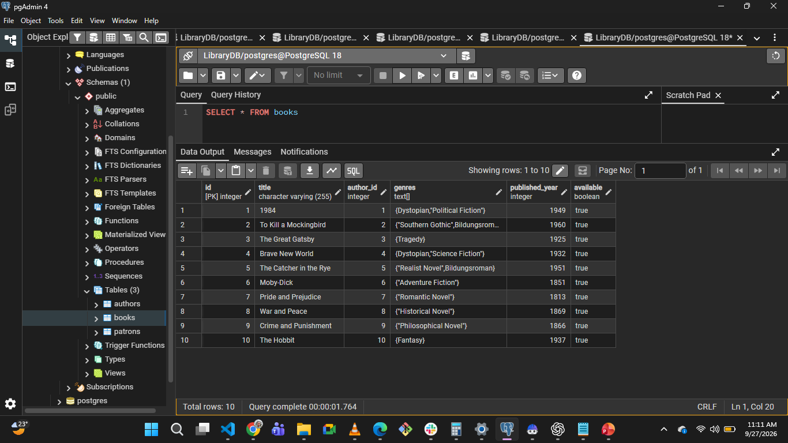

#### Get a Book by Title

Finds the book titled `1984`.

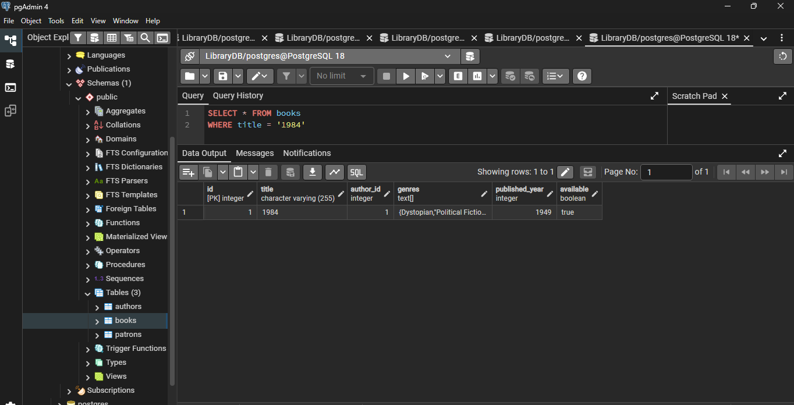

#### Get Books by a Specific Author

Displays all books written by George Orwell.

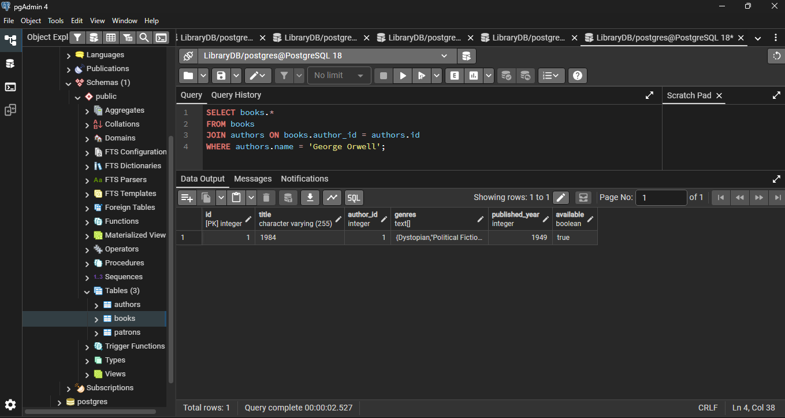

#### Get All Available Books

Displays all books where `available` is `TRUE`.

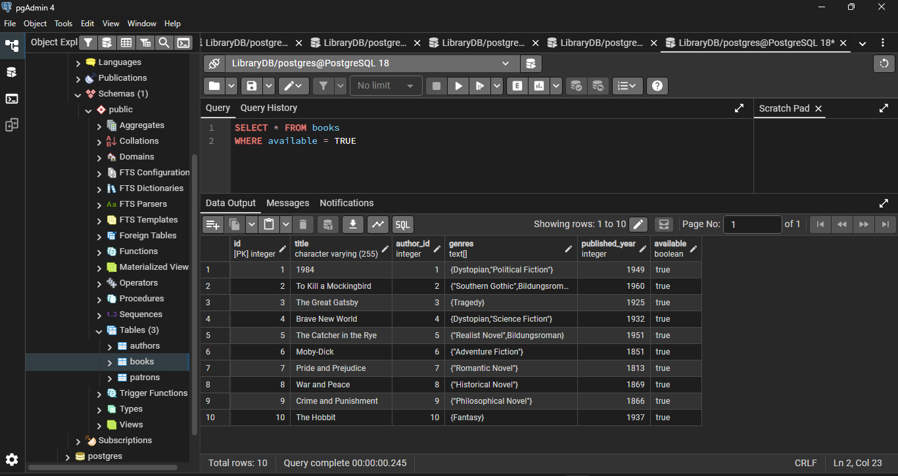

### Update Operations

#### Mark a Book as Borrowed

Updates a book's availability to `FALSE` to indicate it is borrowed.

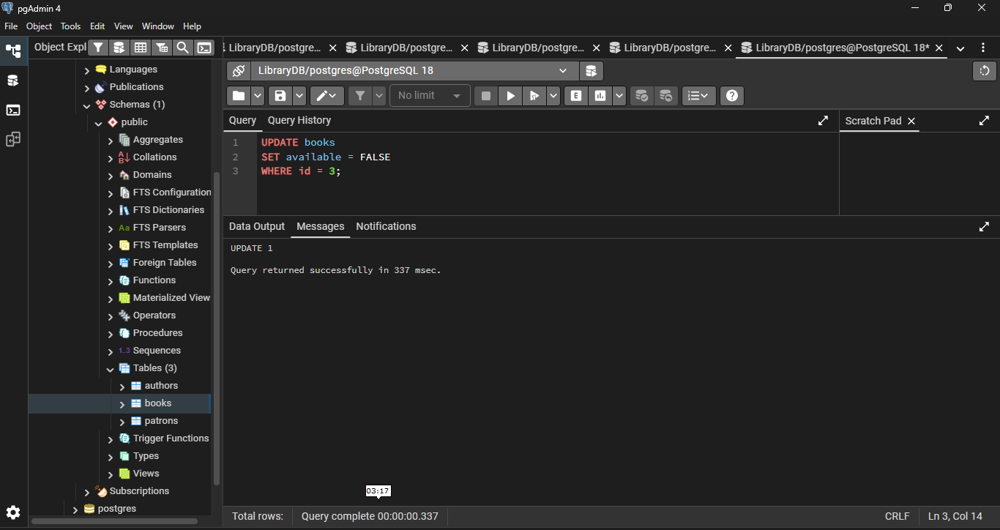

#### Add a New Genre to a Book

Adds a new genre to an existing book's genres array.

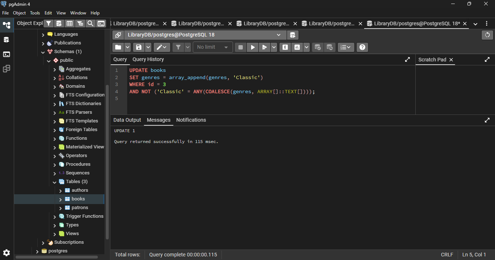

#### Add a Borrowed Book to a Patron's Record

Adds the borrowed book's ID to the patron's `borrowed_books` array.

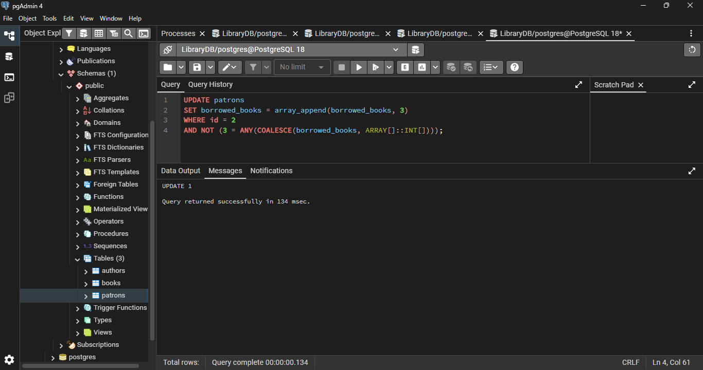

### Delete Operations

#### Delete a Book by Title

Deletes the book titled `1984` from the books table.

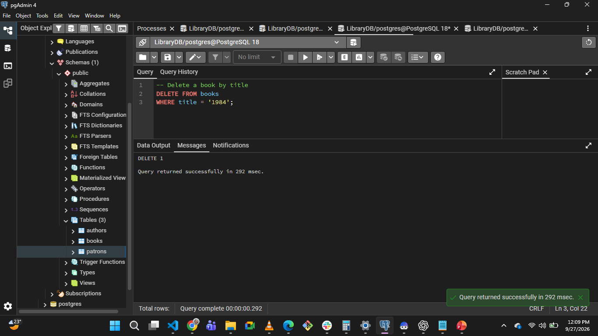

#### Delete an Author by ID

Deletes an author using their ID. Their books are also deleted because of `ON DELETE CASCADE`.

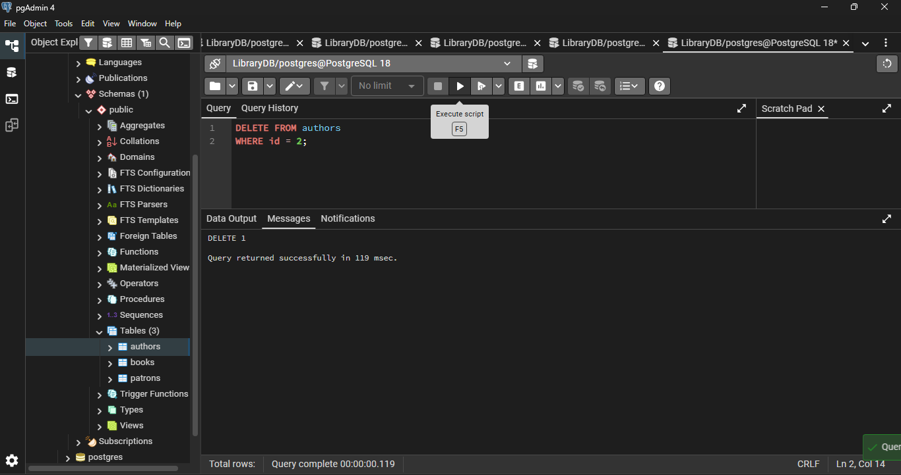

```sql
-- Sprint 3: View books by specific author (e.g., George Orwell, ID = 1)
SELECT * FROM books WHERE author_id = 1;

-- Sprint 4: Track a transaction when Patron 2 borrows Book 3
UPDATE books SET available = FALSE WHERE id = 3;
UPDATE patrons SET borrowed_books = array_append(borrowed_books, 3) WHERE id = 2;

-- Sprint 6: Find all available books published after 1950
SELECT * FROM books WHERE available = TRUE AND published_year > 1950;
```

### Advanced Queries

#### Find Books Published After 1950

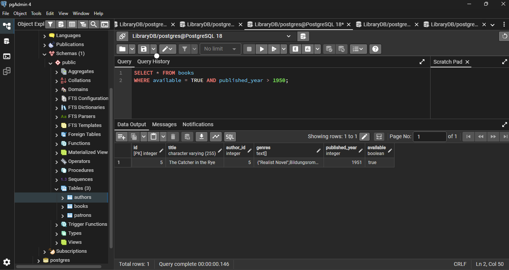

#### Find All American Authors

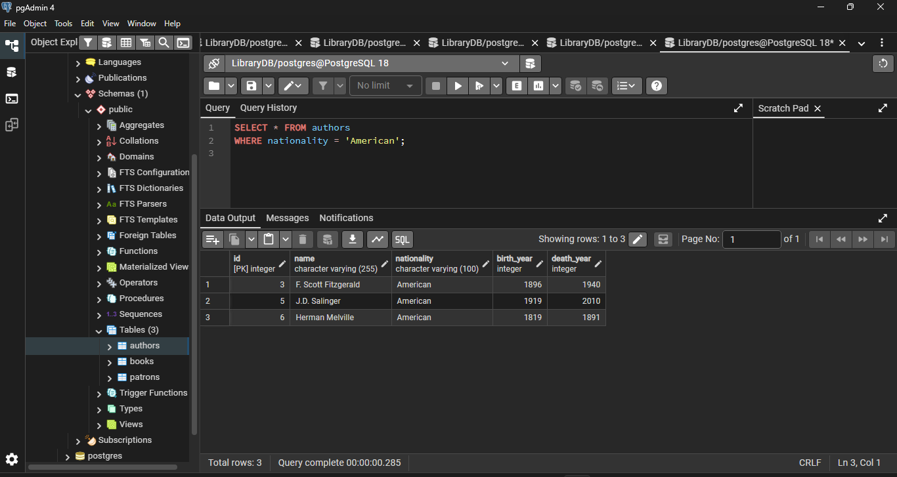

#### Set All Books as Available

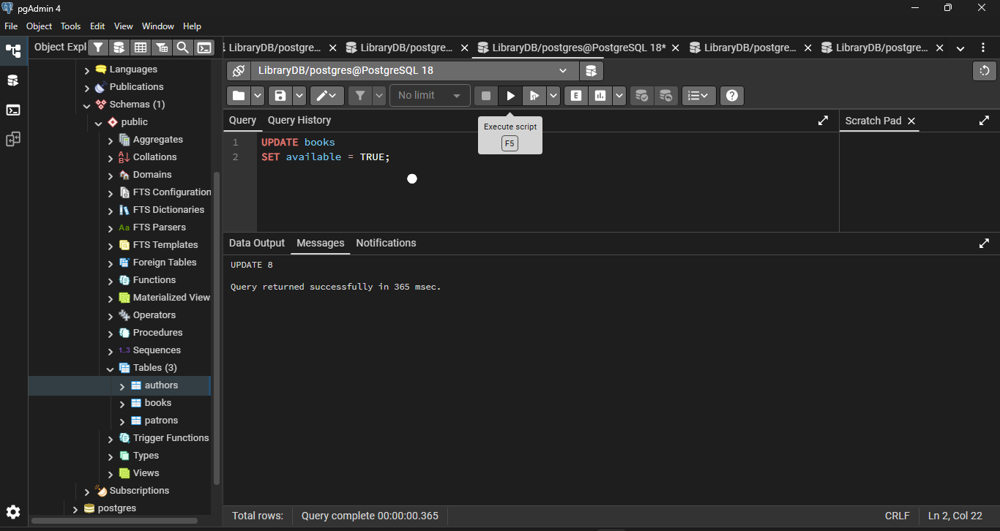

#### Find Available Books Published After 1950

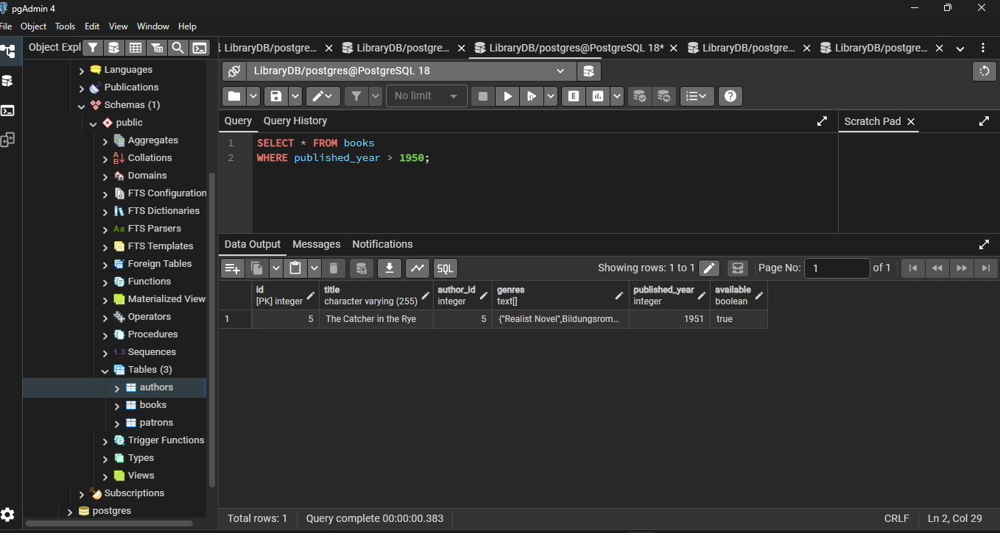

#### Find Authors Whose Names Contain "George"

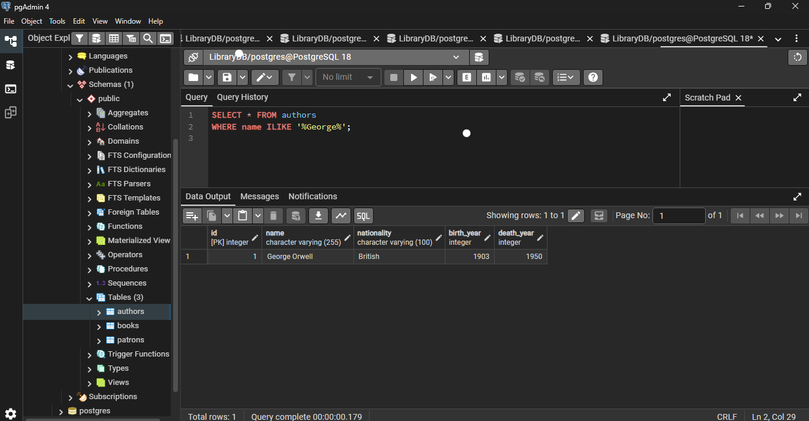

#### Increment the Published Year 1869 by 1

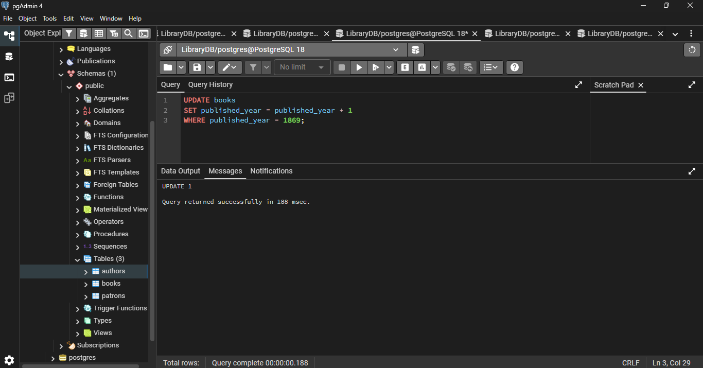